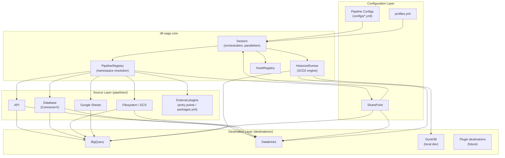
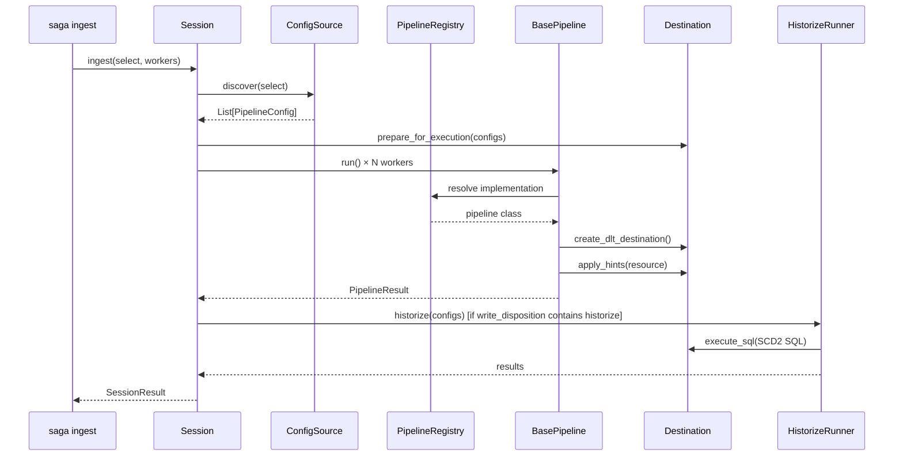
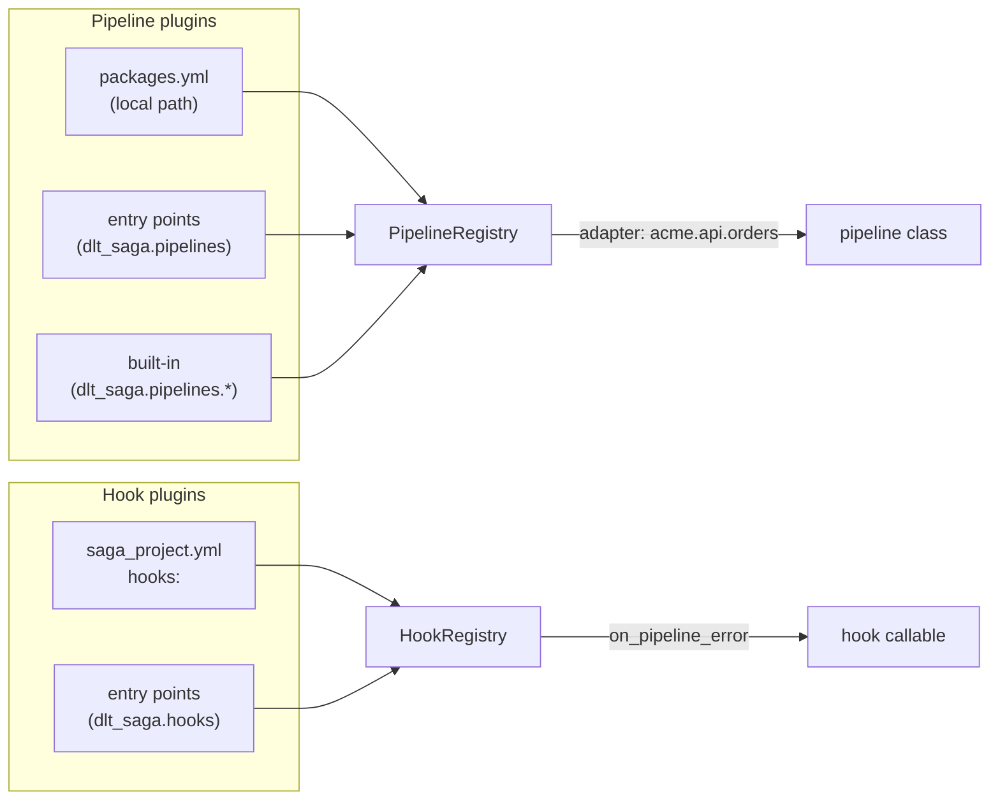
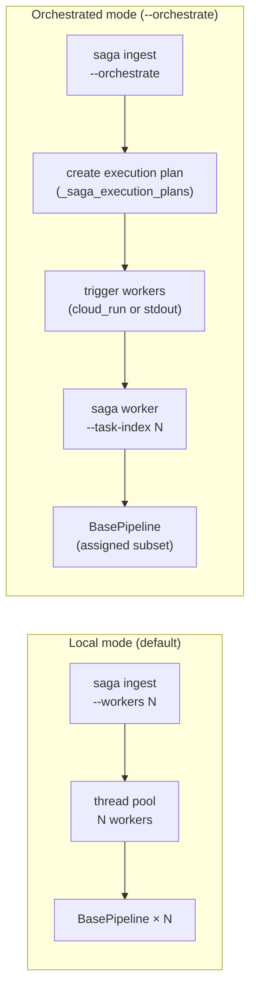

# Architecture Overview

dlt-saga is a config-driven operational layer on top of [dlt](https://dlthub.com/). It adds environment management, SCD2 historization, a plugin system, and orchestration — without replacing dlt's core extract/load engine.

---

## Three-Layer Design



---

## Source Layer (`pipelines/`)

Each source type lives in its own directory: `pipelines/<source_type>/pipeline.py`.

Every implementation extends `BasePipeline` and overrides a single method:

```
BasePipeline
  └── extract_data() → List[Tuple[dlt.resource, description]]
```

`BasePipeline` handles the rest: dlt pipeline creation, `_dlt_ingested_at` injection, write disposition hints, access control, and timing.

**Built-in sources:**

| Source | Notes |
|--------|-------|
| `api` | Generic REST API with incremental cursor support |
| `database` | SQL databases via ConnectorX (PostgreSQL, MySQL, SQL Server, …) with Arrow-native extraction |
| `filesystem` | GCS / SFTP / local files (CSV, JSON, JSONL, Parquet) with snapshot date extraction |
| `google_sheets` | Google Sheets via the Drive API, with change detection |
| `sharepoint` | SharePoint files (xlsx, csv, json, jsonl) via app-only OAuth 2.0; requires `dlt-saga[azure]` |

**Plugin sources** are registered via:
- `packages.yml` (local path packages, any namespace)
- Python entry points (`dlt_saga.pipelines` group, installed packages)

Resolution order: built-in → `packages.yml` → entry points. The `adapter:` field in a config binds a pipeline to a specific implementation explicitly.

---

## Destination Layer (`destinations/`)

Each destination extends `Destination` and implements SQL dialect methods, query methods, and optional access management:

```
Destination (abstract)
  ├── BigQueryDestination
  ├── DatabricksDestination
  └── DuckDBDestination
```

Destinations are registered in `DestinationFactory` and instantiated once per session. Key contracts:

| Contract | Description |
|----------|-------------|
| `create_dlt_destination()` | Returns a dlt destination instance |
| `apply_hints(resource, **hints)` | Partitioning, clustering, etc. |
| `execute_sql(sql, dataset)` | Used by the historize engine |
| SQL dialect methods | `quote_identifier()`, `hash_expression()`, `get_full_table_id()`, etc. |

Capability flags (`supports_partitioning()`, `supports_clustering()`) let pipeline code adapt without destination-specific conditionals.

---

## Configuration Layer

### Pipeline configs (`configs/`)

YAML files discovered at startup. They are hierarchical — defaults flow from `configs/dlt_project.yml` down through folders to individual files using dbt-style `+key` merge syntax.

`PipelineConfig.write_disposition` controls which commands apply:

| Value | `ingest` | `historize` |
|-------|----------|-------------|
| `append`, `merge`, `replace` | ✅ | — |
| `append+historize`, `merge+historize` | ✅ | ✅ |
| `historize` | — | ✅ |

### Profiles (`profiles.yml`)

dbt-style multi-environment configuration. Each target specifies a destination type, connection details, and optional `run_as` for in-process service account impersonation.

### Project config (`saga_project.yml`)

Project-level settings: config source paths, secret provider credentials, orchestration provider, lifecycle hooks, and internal table names.

---

## Session and Execution Flow

`Session` is the single entry point — both the CLI and the programmatic API delegate to it.



Parallelism is handled by `Session` using a thread pool — each `BasePipeline.run()` call is independent.

---

## Historize Engine (`historize/`)

The historize engine transforms raw snapshot tables into [SCD2](https://en.wikipedia.org/wiki/Slowly_changing_dimension#Type_2:_add_new_row) tables. It is destination-agnostic — all SQL is generated via the `Destination` dialect methods.

**Output columns:**

| Column | Description |
|--------|-------------|
| `_dlt_valid_from` | When this version became active |
| `_dlt_valid_to` | When this version was superseded (`NULL` = current) |
| `_dlt_is_deleted` | `TRUE` on deletion marker rows only |

**Two modes:**

- **Incremental** (default) — processes only new snapshots. Uses `LEAD` for within-batch sequencing and `MERGE` to close existing open records.
- **Full refresh** (`--full-refresh`) — rebuilds the SCD2 table from all raw snapshots. Used after config changes (primary key, exclude columns) or data corrections.

State is tracked in `_saga_historize_log` with a config fingerprint that detects changes requiring a full refresh.

---

## Plugin System



Pipeline plugins are lazy-loaded — the base module is never imported at startup, only when a pipeline of that namespace is first resolved. `saga doctor` verifies all registered namespaces are importable.

---

## Orchestration



The `stdout` provider outputs the execution plan as JSON for Airflow, Prefect, Cloud Workflows, or any external orchestrator that manages worker triggering itself.
