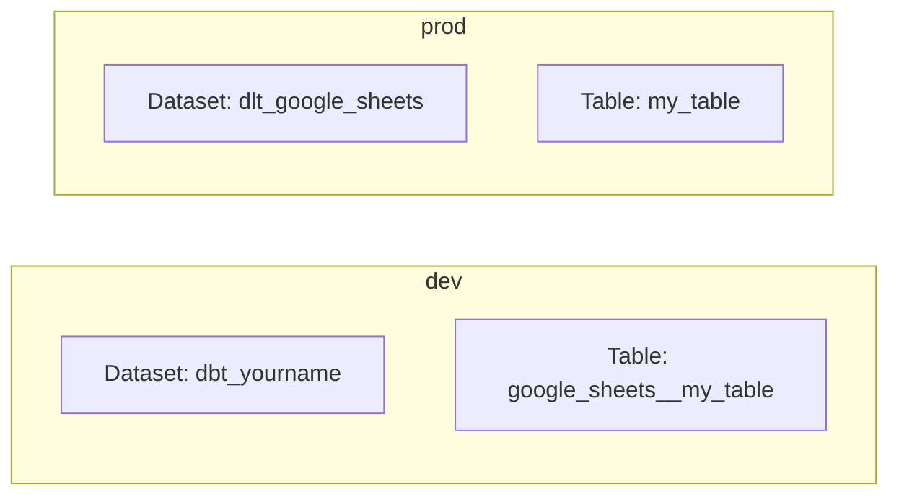

# Profiles System

dbt-style profiles for managing environments (dev, prod, local) without manually switching environment variables.

## Quick Start

1. Create `profiles.yml` in the repo root:

```yaml
default:
  target: dev
  outputs:
    dev:
      type: bigquery
      database: your-dev-project
      location: EU
      schema: "{{ env_var('SAGA_SCHEMA_NAME') }}"
      environment: dev

    prod:
      type: bigquery
      database: your-gcp-project
      location: EU
      environment: prod
      run_as: your-sa@your-project.iam.gserviceaccount.com

    local:
      type: duckdb
      database_path: "./dev.duckdb"
      schema: dev_data
      environment: dev
```

2. Use profiles in CLI:

```bash
saga ingest                                       # Uses default target (dev)
saga ingest --target prod                         # Production (with impersonation)
saga ingest --target local                        # Local DuckDB
```

## Profile Fields

### Common Fields

| Field | Required | Default | Description |
|-------|----------|---------|-------------|
| `type` | **Yes** | — | Destination type: `bigquery`, `databricks`, or `duckdb` |
| `environment` | No | target name | Controls naming strategy (`dev` or `prod`) |
| `schema` | No | auto | Dataset/schema name (supports `{{ env_var('VAR') }}`) |
| `run_as` | No | — | Identity to impersonate (service account email for GCP) |
| `auth_provider` | No | auto | Auth backend: `gcp`, `azure`, `databricks` (inferred from `type` if omitted) |
| `dev_row_limit` | No | — | Limit rows extracted per resource (dev only) |
| `table_format` | No | `native` | Table format: `native` or `iceberg` |

> **Aliases:** `destination_type` is accepted as an alias for `type`, and `dataset` as an alias for `schema`.

### BigQuery Fields

| Field | Required | Default | Description |
|-------|----------|---------|-------------|
| `database` | Yes | — | GCP project ID (aliases: `project`, `project_id`) |
| `location` | No | `EU` | BigQuery location |

### Databricks Fields

| Field | Required | Default | Description |
|-------|----------|---------|-------------|
| `server_hostname` | Yes | — | Workspace hostname, e.g. `adb-1234.12.azuredatabricks.net` |
| `http_path` | Yes | — | Warehouse HTTP path, e.g. `/sql/1.0/warehouses/abc123` |
| `catalog` | Yes | — | Unity Catalog name |
| `auth_mode` | No | SDK auto-detect | Auth mode — see [Databricks Authentication](#databricks-authentication) below |
| `access_token` | No | — | PAT token (`auth_mode: pat` only) |
| `client_id` | No | — | Service principal app ID (`auth_mode: m2m` only) |
| `client_secret` | No | — | Service principal secret (`auth_mode: m2m` only) |
| `staging_volume_name` | No | — | Unity Catalog volume for staging (fully qualified: `catalog.schema.volume`) |
| `staging_credentials_name` | No | — | Named storage credential for `COPY INTO` |

### DuckDB Fields

| Field | Required | Default | Description |
|-------|----------|---------|-------------|
| `database_path` | No | — | DuckDB file path |

## Environment-Aware Naming

The `environment` field (defaults to target name) controls dataset and table naming:



| | Dev | Prod |
|---|-----|------|
| **Dataset** | Single shared dataset (`dbt_yourname`) | Separate per type (`dlt_google_sheets`) |
| **Tables** | Prefixed: `google_sheets__my_table` | Clean: `my_table` |

## Databricks Authentication

The `auth_mode` field controls how dlt-saga authenticates to the Databricks workspace.

| `auth_mode` | Description | Required fields |
|---|---|---|
| `azure_default` | Azure-native credential chain — reads `AZURE_CLIENT_ID` / `AZURE_CLIENT_SECRET` / `AZURE_TENANT_ID`. Works with managed identity on Azure compute. **Recommended for CI/CD.** | none |
| `m2m` | Databricks OAuth service principal. Credentials must be set explicitly in the profile. | `client_id`, `client_secret` |
| `pat` | Static personal access token. | `access_token` |
| `u2m` | Interactive browser OAuth. Token cached by the Databricks SDK. **Local development only.** | none |
| _(omitted)_ | Databricks SDK auto-detect (`DATABRICKS_TOKEN`, `ARM_CLIENT_ID/SECRET/TENANT_ID`, etc.) | — |

### `azure_default` — recommended for production

`azure_default` uses `azure-identity`'s `DefaultAzureCredential`, the same credential chain used by other Azure services in the framework (Key Vault, ADLS). This means a single set of `AZURE_*` environment variables covers all Azure auth:

```yaml
default:
  target: prod
  outputs:
    prod:
      type: databricks
      auth_provider: databricks
      server_hostname: "{{ env_var('DATABRICKS_SERVER_HOSTNAME') }}"
      http_path: "{{ env_var('DATABRICKS_HTTP_PATH') }}"
      catalog: "{{ env_var('DATABRICKS_CATALOG') }}"
      environment: prod
      auth_mode: azure_default
```

Required env vars (GitHub Actions secrets or equivalent):

```
AZURE_CLIENT_ID       # service principal app (client) ID
AZURE_CLIENT_SECRET   # service principal secret
AZURE_TENANT_ID       # Azure AD tenant ID
```

The same service principal should be granted:
- **Databricks workspace** — `Contributor` role (or `Can use` on the SQL warehouse)
- **Key Vault** — `Key Vault Secrets User` (if using `azurekeyvault::` secret URIs)
- **ADLS Gen2** — `Storage Blob Data Reader` on the container (if using `filesystem_type: azure`)

On Azure-hosted compute (Azure VMs, App Service, AKS with workload identity), `DefaultAzureCredential` picks up the managed identity automatically — no env vars required.

`azure_default` requires `dlt-saga[azure]` (`pip install 'dlt-saga[databricks,azure]'`).

---

## Identity Impersonation (`run_as`)

When a target includes `run_as`, the CLI automatically runs as that identity instead of your own credentials. The value is provider-specific — for GCP it's a service account email, for AWS it would be a role ARN.

**GCP example:**

1. Obtains your ADC credentials (application default credentials)
2. Creates impersonated credentials in-process using `google.auth.impersonated_credentials`
3. Monkey-patches `google.auth.default()` so all downstream clients (BigQuery, Sheets, Secret Manager) use the impersonated credentials
4. Restores the original credentials on completion

Impersonation is entirely in-process — no `gcloud` config files are modified and no ADC file is written.

**Requirements (GCP):**
- Application default credentials set up (`gcloud auth application-default login`)
- You have `iam.serviceAccountTokenCreator` on the service account
- The service account has appropriate BigQuery/GCS permissions

## Multiple Profiles

```yaml
default:
  target: dev
  outputs:
    dev: { ... }
    prod: { ... }

analytics:
  target: staging
  outputs:
    staging: { ... }
```

```bash
saga ingest --profile analytics --target staging
```

## Fallback Behaviour

### Profile File Location

The CLI searches for `profiles.yml` in this order:
1. `SAGA_PROFILES_DIR` environment variable (directory containing `profiles.yml`)
2. `./profiles.yml` (repo root — recommended)
3. `.dlt/profiles.yml` (legacy fallback)

### No Profiles Fallback

If `profiles.yml` doesn't exist, the CLI falls back to:
1. Environment variables (`SAGA_ENVIRONMENT`, `SAGA_DESTINATION_DATABASE`, `SAGA_SCHEMA_NAME`, etc.)
2. `.dlt/config.toml` defaults

> The old `DLT_ENVIRONMENT`, `DLT_DESTINATION_PROJECT`, and `DLT_DATASET_NAME` names still work with a deprecation warning.

## Troubleshooting

| Issue | Fix |
|-------|-----|
| "Profile not found" | Check `profiles.yml` exists (repo root or `.dlt/`) and YAML syntax is valid |
| "Failed to set up impersonation" | Verify ADC is set up (`gcloud auth application-default login`) and you have `serviceAccountTokenCreator` role |
| "Target not found" | Check the target name exists in your profile's `outputs` |
| Impersonation not cleaning up | Impersonation is now in-process only — no cleanup needed. If credentials seem stale, re-run `gcloud auth application-default login`. |
