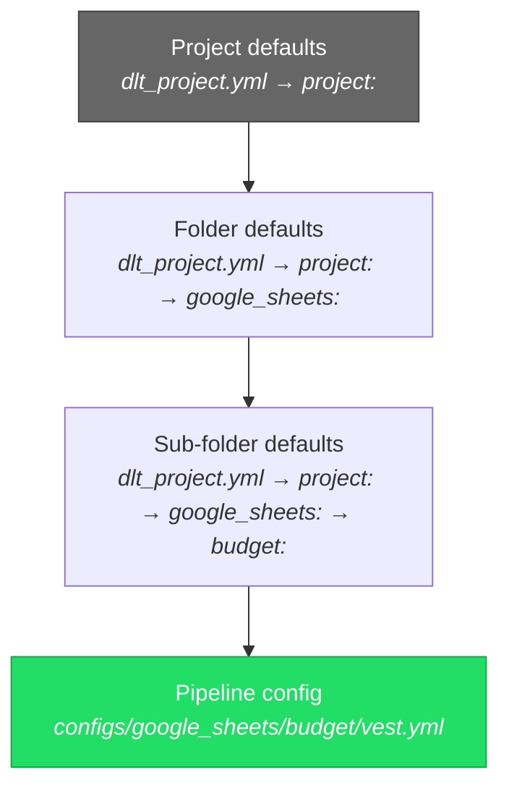

# Configuration Guide

## Hierarchical Configuration

Use `configs/dlt_project.yml` to set defaults that apply across multiple pipelines. Individual pipeline configs inherit and can override these defaults.



**Most specific wins.** A value in the pipeline config overrides folder defaults, which override project defaults.

### Merge Syntax

| Syntax | Behaviour | Example |
|--------|-----------|---------|
| `key:` | **Override** — replaces parent value | `tags: ["custom"]` |
| `+key:` | **Inherit** — merges with parent | `+tags: ["extra"]` adds to parent tags |

### Example

```yaml
# configs/dlt_project.yml
project:
  tags: ["production"]
  access:
    - "group:data-engineers@example.com"

  google_sheets:
    +tags: ["sheets"]              # → ["production", "sheets"]
    write_disposition: "replace"

    regional_budget:
      +tags: ["budget"]            # → ["production", "sheets", "budget"]
```

```yaml
# configs/google_sheets/regional_budget/vest.yml
spreadsheet_id: "123ABC"
# Inherits: tags, access, write_disposition from hierarchy
```

## Pipeline Config Reference

### Common Fields (All Source Types)

| Field | Type | Default | Description |
|-------|------|---------|-------------|
| `enabled` | bool | `true` | Master switch — disables both ingest and historize |
| `tags` | list | `[]` | Tags for selector filtering (`saga ingest --select "tag:daily"`) |
| `write_disposition` | string | `"replace"` | Controls operations — see below |
| `primary_key` | string/list | — | Primary key column(s) for merge/historize |
| `partition_column` | string | — | BigQuery partition column |
| `cluster_columns` | list | — | BigQuery cluster columns (max 4) |
| `dataset_name` | string | — | Override default dataset |
| `access` | list | — | BigQuery IAM access (`"group:email"`, `"user:email"`) |
| `columns` | dict | — | Explicit column type hints — see [Column Hints](#column-hints) |
| `dev_row_limit` | int | — | Limit rows in dev (uses `dlt.resource.add_limit()`) |
| `task_group` | string | — | Group pipelines to run together in orchestration mode |
| `adapter` | string | — | Explicit pipeline implementation binding (e.g., `dlt_saga.api.myservice`) |

### Column Hints

The `columns:` map overrides dlt's inferred types and applies before loading. Each key names a column; the value is a hint object with at least `data_type`.

```yaml
columns:
  Oppty_TargetAmount:        # original source name — recommended for CSV/API sources
    data_type: "double"
  oppty_sold_price_sum:      # dlt-normalized name — also works
    data_type: "double"
  period:
    data_type: "date"
```

**Key naming rules:**

Keys are normalized by dlt using snake_case before being matched against the data. Both forms work:

| Form | Example | Works? |
|------|---------|--------|
| Original source name | `Oppty_TargetAmount` | ✅ |
| dlt-normalized snake_case | `oppty_target_amount` | ✅ |
| Simple lowercase (wrong) | `oppty_targetamount` | ❌ ghost column |

dlt splits CamelCase on word boundaries: `TargetAmount` → `target_amount`, `SoldPriceSum` → `sold_price_sum`. A key that is just lowercased without splitting (e.g., `oppty_targetamount`) will not match the actual column and instead creates a separate column in the destination that is always NULL.

### Write Dispositions

The `write_disposition` field controls which operations are enabled:

| Value | Ingest | Historize | dlt disposition | Use case |
|-------|--------|-----------|-----------------|----------|
| `replace` | Yes | No | `replace` | Full refresh each run |
| `append` | Yes | No | `append` | Raw event/log data |
| `merge` | Yes | No | `merge` | Upsert on primary key |
| `append+historize` | Yes | Yes | `append` | Snapshot → SCD2 |
| `merge+historize` | Yes | Yes | `merge` | Upsert + build SCD2 history |
| `historize` | No | Yes | — | External table → SCD2 |

### Merge Strategies (when `write_disposition: merge`)

| Strategy | Description |
|----------|-------------|
| `delete-insert` | Delete matching rows, insert new |
| `scd2` | dlt's built-in SCD2 (distinct from historize) |
| `upsert` | Update existing, insert new |

```yaml
write_disposition: "merge"
merge_strategy: "scd2"
primary_key: "id"
```

### Incremental Loading

```yaml
incremental: true
incremental_key: "updated_at"        # Column to track
initial_value: "2025-01-01"          # Starting value
```

Override at runtime for backfills:
```bash
saga ingest --select "my_pipeline" --start-value-override "2025-06-01"
```

## Source-Specific Fields

### API

| Field | Type | Description |
|-------|------|-------------|
| `base_url` | string | API base URL |
| `endpoint` | string | API endpoint path |
| `auth_type` | string | Authentication type (`bearer`, `basic`, etc.) |
| `auth_token` | string | Token or secret reference |

> API pipelines use polymorphic loading — custom implementations in `pipelines/api/<api_name>/` override the base `ApiPipeline`.

### Database

| Field | Type | Description |
|-------|------|-------------|
| `connection_string` | string | Full connection string (alternative to components) |
| `database_type` | string | `postgres`, `mysql`, `mssql`, `oracle`, etc. |
| `host` | string | Database hostname |
| `port` | int | Database port |
| `source_database` | string | Database name |
| `source_schema` | string | Schema name |
| `source_table` | string | Table to extract |
| `username` | string | Username or secret reference |
| `password` | string | Password or secret reference |
| `query` | string | Custom SQL query (alternative to `source_table`) |
| `partition_on` | string | Column for parallel reading |
| `partition_num` | int | Number of partitions for parallel reading |

### Filesystem

| Field | Type | Description |
|-------|------|-------------|
| `filesystem_type` | string | `gs`, `sftp`, `file` |
| `bucket_name` | string | Bucket or container name |
| `file_glob` | string | Glob pattern (`data/*.csv`) |
| `file_type` | string | `csv`, `json`, `jsonl`, `parquet` |
| `csv_separator` | string | CSV delimiter (default: `,`) |
| `snapshot_date_regex` | string | Regex to extract dates from file paths |
| `snapshot_date_format` | string | Date format for extracted dates (e.g., `%Y-%m-%d`) |

### Google Sheets

| Field | Type | Description |
|-------|------|-------------|
| `spreadsheet_id` | string | From the spreadsheet URL |
| `sheet_name` | string | Specific sheet/tab name |
| `range` | string | Cell range in A1 notation (default: `A:Z`) |

### SharePoint

Requires `pip install "dlt-saga[azure]"`. Set `adapter: dlt_saga.sharepoint` in the config.

| Field | Type | Required | Description |
|-------|------|----------|-------------|
| `auth_secret` | string | yes | Secret URI resolving to the OAuth2 form body (e.g. `azurekeyvault::https://vault.azure.net::MY-SECRET`) |
| `tenant_id` | string | yes | Azure AD tenant ID (GUID) |
| `site_url` | string | yes | SharePoint site base URL (e.g. `https://contoso.sharepoint.com/sites/MySite`) |
| `file_path` | string | yes | Server-relative path to the file (e.g. `/sites/MySite/Shared Documents/report.xlsx`) |
| `file_type` | string | yes | `xlsx`, `csv`, `json`, or `jsonl` |
| `sheet_name` | string | no | Excel sheet name (default: active/first sheet) |
| `header_row` | int | no | 1-indexed row containing column headers (default: `1`) |
| `csv_separator` | string | no | CSV delimiter (default: `,`) |
| `encoding` | string | no | File encoding (default: `utf-8`) |

## Historize Configuration

The `historize:` section configures SCD2 historization for pipelines with `append+historize` or `historize` write dispositions.

```yaml
write_disposition: "append+historize"
primary_key: [orgnr]

historize:
  snapshot_column: "_dlt_ingested_at"  # Default — column identifying snapshots
  exclude_columns: [_dlt_source_file_name]
  partition_column: "_dlt_valid_from"
  cluster_columns: [orgnr]
  track_deletions: true                # Detect deleted rows between snapshots
  output_table: "custom_table_name"    # Override default output table name
  output_table_suffix: "_historized"   # Suffix for auto-generated name
```

| Field | Type | Default | Description |
|-------|------|---------|-------------|
| `snapshot_column` | string | `_dlt_ingested_at` | Column identifying snapshot timestamps |
| `primary_key` | list | inherited | Inherits from top-level `primary_key` |
| `exclude_columns` | list | `[]` | Columns to ignore in change detection |
| `partition_column` | string | — | Partition the output table |
| `cluster_columns` | list | — | Cluster the output table |
| `track_deletions` | bool | `false` | Detect rows deleted between snapshots |
| `output_table` | string | auto | Override output table name |
| `output_table_suffix` | string | `_historized` | Suffix for auto-generated name |

### Historize-Only (External Data)

For data loaded outside dlt-saga, use `write_disposition: "historize"` and specify the source location:

```yaml
write_disposition: "historize"
primary_key: [order_id]

# Source location (top-level, not under historize:)
source_database: "your-gcp-project"
source_schema: "external_deliveries"
source_table: "customer_orders_raw"

historize:
  snapshot_column: "delivery_date"
  track_deletions: true
```

## Schema Validation

JSON schema files in `schemas/` provide IDE autocomplete and validation. VS Code applies them automatically via `.vscode/settings.json`.

Run `saga generate-schemas` to regenerate them after upgrading dlt-saga.

---

## Project Configuration (`saga_project.yml`)

The `saga_project.yml` file in the repo root controls project-level settings. It is separate from pipeline configs — `saga init` generates a starter file.

### Config Source

```yaml
config_source:
  type: file
  paths: ["configs", "shared_configs"]  # multiple directories supported
  # Single-directory shorthand (backward-compatible):
  # path: configs
```

Duplicate pipeline names discovered across directories are an error.

### Providers

Credentials for secret managers and external APIs:

```yaml
providers:
  google_secrets:
    project_id: your-gcp-project           # GCP project containing the secrets
    sheets_secret_name: google-sheets-sa   # Secret name for Google Sheets credentials
```

### Orchestration

```yaml
orchestration:
  provider: cloud_run   # or stdout (for Airflow / Cloud Workflows / Prefect)
  region: europe-west1
  job_name: dlt-saga-worker
  schema: dlt_orchestration
```

See the [Deployment Guide](Deployment) for full setup.

### Hooks

```yaml
hooks:
  on_pipeline_start:
    - mypackage.hooks:log_start
  on_pipeline_complete:
    - mypackage.hooks:emit_metrics
  on_pipeline_error:
    - mypackage.hooks:send_alert
```

See the [Plugin Development Guide](Plugin-Development) for writing hooks.

### Log Tables

Internal tracking table names. **Do not change after first run** — renaming these tables orphans existing tracking data and breaks incremental state:

```yaml
log_tables:
  load_info: "_saga_load_info"
  historize_log: "_saga_historize_log"
  execution_plans: "_saga_execution_plans"
  executions: "_saga_executions"
```
