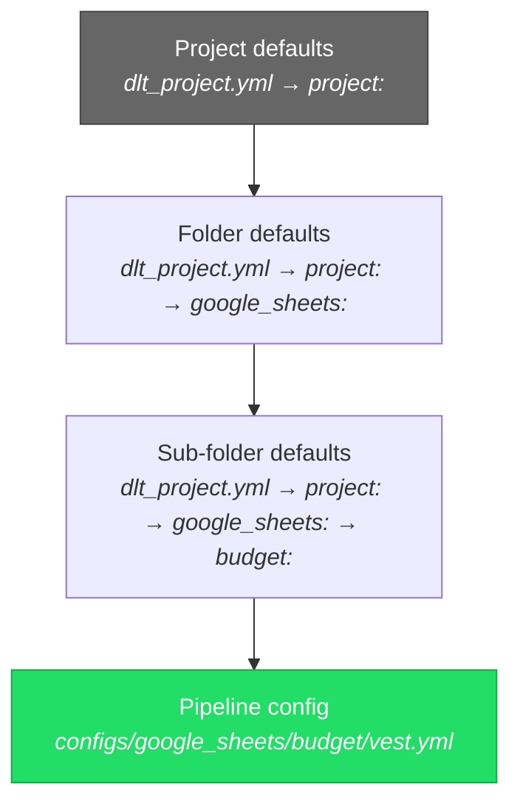

# Configuration Guide

## Hierarchical Configuration

Use `configs/dlt_project.yml` to set defaults that apply across multiple pipelines. Individual pipeline configs inherit and can override these defaults.



**Most specific wins.** A value in the pipeline config overrides folder defaults, which override project defaults.

### Merge Syntax

| Syntax | Behaviour | Example |
|--------|-----------|---------|
| `key:` | **Override** — replaces parent value | `tags: ["custom"]` |
| `+key:` | **Inherit** — merges with parent | `+tags: ["extra"]` adds to parent tags |

### Example

```yaml
# configs/dlt_project.yml
project:
  tags: ["production"]
  access:
    - "group:data-engineers@example.com"

  google_sheets:
    +tags: ["sheets"]              # → ["production", "sheets"]
    write_disposition: "replace"

    regional_budget:
      +tags: ["budget"]            # → ["production", "sheets", "budget"]
```

```yaml
# configs/google_sheets/regional_budget/vest.yml
spreadsheet_id: "123ABC"
# Inherits: tags, access, write_disposition from hierarchy
```

## Pipeline Config Reference

### Common Fields (All Source Types)

| Field | Type | Default | Description |
|-------|------|---------|-------------|
| `enabled` | bool | `true` | Master switch — disables both ingest and historize |
| `tags` | list | `[]` | Tags for selector filtering (`saga ingest --select "tag:daily"`). Supports schedule values — see [Scheduling tags](#scheduling-tags) |
| `write_disposition` | string | `"replace"` | Controls operations — see below |
| `primary_key` | string/list | — | Primary key column(s) for merge/historize |
| `partition_column` | string | — | BigQuery partition column |
| `cluster_columns` | list | — | BigQuery cluster columns (max 4) |
| `partition_expiration_days` | int | inherited from profile | BigQuery only. Sets `time_partitioning.expiration_ms` on the created table. Honored on first `CREATE TABLE` for both dlt-managed pipelines and `native_load`, and reconciled on every subsequent run — changing or unsetting the value emits `ALTER TABLE ... SET OPTIONS(partition_expiration_days = ...)` against the existing table. Pipeline-level value overrides the profile default. Has no effect on Iceberg tables. |
| `insert_api` | string | — | Databricks-only: `zerobus` (low-latency append) or `copy_into` (default). See [Databricks insert API](#databricks-insert-api) |
| `dataset_name` | string | — | Override default dataset |
| `access` | list | — | BigQuery IAM access (`"group:email"`, `"user:email"`) |
| `columns` | dict | — | Explicit column type hints — see [Column Hints](#column-hints) |
| `dev_row_limit` | int | — | Consumer-side row cap (set on the profile target). Only shortens extraction for resources that stream lazily; for windowed/incremental sources use `dev:` instead — see [Dev Overrides](#dev-overrides) |
| `dev` | dict | — | Override block applied only in the `dev` environment (and stripped elsewhere) — see [Dev Overrides](#dev-overrides) |
| `task_group` | string | — | Group pipelines to run together in orchestration mode |
| `adapter` | string | — | Explicit pipeline implementation binding (e.g., `dlt_saga.api.myservice`) |
| `filters` | list | — | Row-level filters applied during ingest — see [Row Filters](#row-filters) |

### Column Hints

The `columns:` map overrides dlt's inferred types and applies before loading. Each key names a column; the value is a hint object with at least `data_type`.

```yaml
columns:
  Oppty_TargetAmount:        # original source name — recommended for CSV/API sources
    data_type: "double"
  oppty_sold_price_sum:      # dlt-normalized name — also works
    data_type: "double"
  period:
    data_type: "date"
```

**Key naming rules:**

Keys are normalized by dlt using snake_case before being matched against the data. Both forms work:

| Form | Example | Works? |
|------|---------|--------|
| Original source name | `Oppty_TargetAmount` | ✅ |
| dlt-normalized snake_case | `oppty_target_amount` | ✅ |
| Simple lowercase (wrong) | `oppty_targetamount` | ❌ ghost column |

dlt splits CamelCase on word boundaries: `TargetAmount` → `target_amount`, `SoldPriceSum` → `sold_price_sum`. A key that is just lowercased without splitting (e.g., `oppty_targetamount`) will not match the actual column and instead creates a separate column in the destination that is always NULL.

### Row Filters

Drop unwanted rows during ingest using a declarative `filters:` block. Multiple entries compose as **AND**.

```yaml
filters:
  - column: config              # required: top-level column name
    path: aid.legal_entity      # optional: dotted JSON path into the value
    value: bm                   # required for eq/ne/in/not_in/matches
  - column: status
    op: ne
    value: archived
```

| Op | Value | Description |
|----|-------|-------------|
| `eq` (default) | scalar | Column equals value |
| `ne` | scalar | Not equal |
| `in` | non-empty list | Value in list |
| `not_in` | non-empty list | Value not in list |
| `is_null` | (omit) | Value is NULL |
| `is_not_null` | (omit) | Value is not NULL |
| `matches` | regex string | Regex match (Python `re.search` / `REGEXP_CONTAINS` / `RLIKE`) |

**JSON path access.** When `path` is set, the filter drills into a nested object on the column's value. Columns that hold a JSON-encoded string (common with Sheets / API sources) are parsed automatically — no extra config. Path access returns NULL when any intermediate key is missing, so the row is dropped under `eq`/`ne`/`in`/`not_in`/`matches` and counted as null under `is_null`/`is_not_null`.

**Path comparisons are STRING.** Path-based JSON access returns a string scalar on every destination, so both the extracted leaf and the configured `value:` are coerced to STRING before comparison. Booleans use lowercase `"true"`/`"false"` to match JSON wire form; integers and floats are stringified. This keeps Python and SQL evaluation identical — `value: 5` matches a JSON leaf `5` whether the pipeline runs in-process or pushes down to the warehouse. For typed numeric comparisons on a path leaf, use a top-level typed column (or open a follow-up for an explicit `cast:` knob).

**Prefer source-level pushdown when available.** For sources that filter natively — `database` (use a `WHERE` in the SQL query), `api` (use a query parameter) — apply the filter there. `filters:` is the fallback for sources that don't support native filtering (Sheets, filesystem, SharePoint) and for keeping the predicate visible in YAML for stacks where that matters. With `native_load` the filter pushes down to the warehouse engine, so `filters:` is the right place for that adapter regardless of source.

**Multi-resource pipelines.** A filter on `config` does not affect resources that lack a `config` column — the filter silently skips when the column is absent, so unrelated tables are not wiped.

**Top-level vs `historize.filters`.** The top-level `filters:` block on this page applies only to the **ingest** stage (raw rows entering the destination). For SCD2 historization there's a separate `historize.filters:` block under the `historize:` section — same schema, but it applies only to the historize source read. They run independently and stack: for `append+historize`, top-level filters shape the raw append table; `historize.filters:` shapes the SCD2 history built from it. See [Filtering the source](Historize#filtering-the-source) in the Historize docs.

**Pushdown for `native_load`.** When the pipeline uses `adapter: dlt_saga.native_load`, filters are rendered into the load SELECT as a `WHERE` clause and applied by the warehouse engine. Filtered-out rows are never materialised in the target table or in Python memory:

```sql
-- BigQuery (INSERT … SELECT FROM <external table>):
INSERT INTO `proj.ds.tbl` (...)
SELECT ... FROM `proj.ds_staging.ext_abc123`
WHERE JSON_VALUE(`config`, '$.aid.legal_entity') = 'bm'

-- Databricks (COPY INTO with a SELECT subquery):
COPY INTO `cat`.`ds`.`tbl`
FROM (SELECT * FROM 'gs://bucket/...' WHERE `config`:aid.legal_entity = 'bm')
FILEFORMAT = PARQUET ...
```

The same `filters` block applies to both first-run CTAS and subsequent INSERT/COPY INTO so the target stays consistent across runs.

**Filter column resolution.** In all paths the `column:` value refers to the **source** column name (the field the source emits, before any normalization). For `native_load` on BigQuery the column is matched case-insensitively against the external table; for Databricks `COPY INTO` the file's column name is used verbatim. Unknown columns raise a clear `ValueError` at SQL-build time rather than silently producing no rows.

**Performance.** For non-`native_load` pipelines the predicate evaluates per row in Python. For small reference tables (Sheets, configs, dimension tables) this is negligible. For PyArrow batches the table is materialised via `to_pylist()` for the row-level evaluation — fine for the common cases but worth pushing down at the source when filtering tens of millions of rows.

### Write Dispositions

The `write_disposition` field controls which operations are enabled:

| Value | Ingest | Historize | dlt disposition | Use case |
|-------|--------|-----------|-----------------|----------|
| `replace` | Yes | No | `replace` | Full refresh each run |
| `append` | Yes | No | `append` | Raw event/log data |
| `merge` | Yes | No | `merge` | Upsert on primary key |
| `append+historize` | Yes | Yes | `append` | Snapshot → SCD2 |
| `merge+historize` | Yes | Yes | `merge` | Upsert + build SCD2 history |
| `historize` | No | Yes | — | External table → SCD2 |

### Merge Strategies (when `write_disposition: merge`)

| Strategy | Description |
|----------|-------------|
| `delete-insert` | Delete matching rows, insert new |
| `scd2` | dlt's built-in SCD2 (distinct from historize) |
| `upsert` | Update existing, insert new |
| `insert-only` | Idempotent append: insert rows whose `primary_key` isn't already in the target; never update or delete existing rows. Requires `primary_key`; `merge_key` is not supported. |

```yaml
write_disposition: "merge"
merge_strategy: "scd2"
primary_key: "id"
```

`insert-only` is the right pick when re-running the same batch must not produce duplicates but you also don't want the cost of a full MERGE. Append-style sources (events, logs, transactions) with a stable `primary_key` are the typical fit:

```yaml
write_disposition: "merge"
merge_strategy: "insert-only"
primary_key: "event_id"
```

### Databricks insert API

On the Databricks destination, `insert_api` selects how rows are written into the Delta table:

| Value | Description |
|-------|-------------|
| _unset_ | Default — `COPY INTO` via Unity Catalog volume staging. |
| `copy_into` | Same as unset, but explicit. |
| `zerobus` | Loads via the Databricks Zerobus SDK. Lower per-batch overhead than `COPY INTO` and useful for high-throughput append workloads. Only valid with `write_disposition: append` or `append+historize`. |

```yaml
write_disposition: "append+historize"
insert_api: "zerobus"
primary_key: [id]

historize:
  partition_column: "_dlt_valid_from"
  cluster_columns: [id]
```

Ignored on BigQuery and DuckDB destinations (a warning is logged).

### Incremental Loading

```yaml
incremental: true
incremental_column: "updated_at"     # Column to track
initial_value: "2025-01-01"          # Starting value
```

Override at runtime for backfills:
```bash
saga ingest --select "my_pipeline" --start-value-override "2025-06-01"
```

### Dev Overrides

A `dev:` block carries values that apply **only when the active environment is `dev`**. Its keys override the corresponding top-level keys; the block is always stripped, so it never reaches production or the pipeline itself. The most common use is a smaller `initial_value` so dev runs load a recent slice instead of full history (the cost of a windowed/incremental source is its time range — shrinking the range is what makes dev fast, which `dev_row_limit` cannot do for these sources):

```yaml
initial_value: "2020-01-01"          # prod seed, untouched
dev:
  initial_value: "{{ (datetime.now(timezone.utc) - timedelta(days=7)).strftime('%Y-%m-%d') }}"
```

The block follows the normal config hierarchy. The natural place for a shared `initial_value` is a **folder (pipeline-group) default** in `saga_project.yml`, since pipelines in a group usually share a cursor type (all dates, or all numeric IDs) — a single project-wide value rarely fits every group at once:

```yaml
# saga_project.yml
pipelines:
  api:                                  # applies to all configs/api/** pipelines
    +dev:
      initial_value: "{{ (datetime.now(timezone.utc) - timedelta(days=7)).strftime('%Y-%m-%d') }}"
```

A project-wide `pipelines: +dev:` default and a per-pipeline `dev:` block in the config file are also supported; more specific levels win (file > folder > project), so use the project-wide form only for overrides that are genuinely uniform across all groups.

**Dynamic values via templating.** Config values are rendered with Jinja at load time, and the standard-library `datetime`, `timedelta` and `timezone` are in scope alongside `env_var(...)`. This keeps the expression self-evident at the call site — the subtraction, the timezone and the output format are all visible — and because it's evaluated each run the seed is a **rolling** date that never goes stale. It's plain Python, so it composes for any cursor shape (a numeric-ID source just won't use date math).

### Scheduling tags

The `tags` field accepts plain labels (`critical`, `api`) and **schedule-aware** values for `daily` and `hourly`. Schedule-aware tags filter against current UTC time when the orchestrator fires `tag:daily` / `tag:hourly`.

```yaml
tags:
  - critical                       # plain label — always matches tag:critical
  - daily                          # runs any day (matches tag:daily anytime)
  - hourly: [1, 10]                # runs at 1am and 10am every day
  - daily: [2, 28]                 # runs on the 2nd and 28th
  - daily: [monday, friday]        # runs Mondays and Fridays
  - daily: [2, monday]             # runs on the 2nd OR any Monday
  - hourly: [monday]               # runs every hour on Mondays
  - hourly:                        # mixed per-weekday + bare hour
    - monday: [6]                  # Mon @ 6am
    - tuesday: [6]                 # Tue @ 6am
    - 9                            # AND every day @ 9am
```

**Per-weekday hourly bindings** (the nested form above) let a pipeline declare disjoint `(weekday, hour)` runs inside a single tag. With an orchestrator that fires `tag:hourly` every hour, the pipeline self-constrains: Mon@6, Tue@6, and 9am every day fire — Wed@6 does not.

Selector reference:

| Selector | Matches |
|----------|---------|
| `tag:hourly` | Configs whose hourly tag matches current `(hour, weekday)` |
| `tag:hourly:10` | Configs that explicitly include hour 10 (anywhere — bare list or per-weekday) |
| `tag:daily` | Configs whose daily tag matches current `(day, weekday)` |
| `tag:daily:monday` | Configs that include Monday in their daily tag |
| `tag:critical` | Configs with the `critical` tag (no time constraint) |

## Source-Specific Fields

### API

| Field | Type | Description |
|-------|------|-------------|
| `base_url` | string | API base URL |
| `endpoint` | string | API endpoint path |
| `auth_type` | string | Authentication type (`bearer`, `basic`, etc.) |
| `auth_token` | string | Token or secret reference |

> API pipelines use polymorphic loading — custom implementations in `pipelines/api/<api_name>/` override the base `ApiPipeline`.

### Database

| Field | Type | Description |
|-------|------|-------------|
| `connection_string` | string | Full connection string (alternative to components) |
| `database_type` | string | `postgres`, `mysql`, `mssql`, `oracle`, etc. |
| `host` | string | Database hostname |
| `port` | int | Database port |
| `source_database` | string | Database name |
| `source_schema` | string | Schema name |
| `source_table` | string | Table to extract |
| `username` | string | Username or secret reference |
| `password` | string | Password or secret reference |
| `query` | string | Custom SQL query (alternative to `source_table`) |
| `partition_on` | string | Column for parallel reading |
| `partition_num` | int | Number of partitions for parallel reading |

### Filesystem

| Field | Type | Description |
|-------|------|-------------|
| `filesystem_type` | string | `gs`, `sftp`, `file` |
| `bucket_name` | string | Bucket or container name |
| `file_glob` | string | Glob pattern (`data/*.csv`) |
| `file_type` | string | `csv`, `json`, `jsonl`, `parquet` |
| `csv_separator` | string | CSV delimiter (default: `,`) |
| `snapshot_date_regex` | string | Regex to extract dates from file paths |
| `snapshot_date_format` | string | Date format for extracted dates (e.g., `%Y-%m-%d`) |

### Google Sheets

| Field | Type | Description |
|-------|------|-------------|
| `spreadsheet_id` | string | From the spreadsheet URL |
| `sheet_name` | string | Specific sheet/tab name |
| `range` | string | Cell range in A1 notation (default: `A:Z`) |

### SharePoint

Requires `pip install "dlt-saga[azure]"`. Set `adapter: dlt_saga.sharepoint` in the config.

Authenticate with **either** Entra ID certificate auth (`client_id` + `certificate`, recommended) **or** the deprecated legacy Azure ACS flow (`token_request_body`). Azure ACS for SharePoint Online was retired by Microsoft on 2 April 2026 — use the certificate method.

| Field | Type | Required | Description |
|-------|------|----------|-------------|
| `client_id` | string | cert auth | Entra ID application (client) ID. Required with `certificate`. |
| `certificate` | string | cert auth | PEM (certificate + private key) — plain value or secret URI (e.g. `azurekeyvault::https://vault.azure.net::MY-CERT`). Enables Entra ID app-only auth. |
| `certificate_password` | string | no | Password for the private key, if encrypted. |
| `token_request_body` | string | ACS auth | **Deprecated** (Azure ACS, retired 2 April 2026). OAuth2 token-request form body — plain value or secret URI. Previously `auth_secret` (still accepted, deprecated). |
| `tenant_id` | string | yes | Azure AD tenant ID (GUID) |
| `site_url` | string | yes | SharePoint site base URL (e.g. `https://contoso.sharepoint.com/sites/MySite`) |
| `file_path` | string | yes | Server-relative path to the file (e.g. `/sites/MySite/Shared Documents/report.xlsx`) |
| `file_type` | string | yes | `xlsx`, `csv`, `json`, or `jsonl` |
| `sheet_name` | string | no | Excel sheet name (default: active/first sheet) |
| `header_row` | int | no | 1-indexed row containing column headers (default: `1`) |
| `csv_separator` | string | no | CSV delimiter (default: `,`) |
| `encoding` | string | no | File encoding (default: `utf-8`) |

## Historize Configuration

The `historize:` section configures SCD2 historization for pipelines with `append+historize` or `historize` write dispositions.

```yaml
write_disposition: "append+historize"
primary_key: [orgnr]

historize:
  snapshot_column: "_dlt_ingested_at"  # Default — column identifying snapshots
  ignore_columns: [updated_by]
  partition_column: "_dlt_valid_from"
  cluster_columns: [orgnr]
  track_deletions: true                # Detect deleted rows between snapshots
  table_format: iceberg                # Override table format for this pipeline only
  output_schema: "my_historized"       # Write to a different schema (optional)
  output_table: "custom_table_name"    # Explicit output table name (optional)
  output_table_suffix: "_historized"   # Suffix when output_table is not set
```

| Field | Type | Default | Description |
|-------|------|---------|-------------|
| `snapshot_column` | string | `_dlt_ingested_at` | Column identifying snapshot timestamps |
| `primary_key` | list | inherited | Inherits from top-level `primary_key` |
| `track_columns` | list | — | Opt-in allowlist for change detection (all columns still in output) |
| `ignore_columns` | list | `[]` | Columns excluded from change detection (still in output) |
| `partition_column` | string | — | Partition the output table |
| `cluster_columns` | list | — | Cluster the output table |
| `track_deletions` | bool | `false` | Detect rows deleted between snapshots |
| `table_format` | string | inherited | Table format override for this pipeline's historized table |
| `output_schema` | string | — | Write the historized table to a different schema |
| `output_table` | string | — | Explicit name for the historized output table |
| `output_table_suffix` | string | `_historized` | Suffix appended to the source table name when `output_table` is not set |

### Historize-Only (External Data)

For data loaded outside dlt-saga, use `write_disposition: "historize"` and specify the source location:

```yaml
write_disposition: "historize"
primary_key: [order_id]

# Source location (top-level, not under historize:)
source_database: "your-gcp-project"
source_schema: "external_deliveries"
source_table: "customer_orders_raw"

historize:
  snapshot_column: "delivery_date"
  track_deletions: true
```

## Schema Validation

JSON schema files in `schemas/` provide IDE autocomplete and validation. VS Code applies them automatically via `.vscode/settings.json`.

Run `saga generate-schemas` to regenerate them after upgrading dlt-saga.

---

## Project Configuration (`saga_project.yml`)

The `saga_project.yml` file in the repo root controls project-level settings. It is separate from pipeline configs — `saga init` generates a starter file.

### Config Source

```yaml
config_source:
  type: file
  paths: ["configs", "shared_configs"]  # multiple directories supported
  # Single-directory shorthand (backward-compatible):
  # path: configs
```

Duplicate pipeline names discovered across directories are an error.

### Providers

Credentials for secret managers and external APIs:

```yaml
providers:
  google_secrets:
    project_id: your-gcp-project           # GCP project containing the secrets
    sheets_secret_name: google-sheets-sa   # Secret name for Google Sheets credentials
```

### Orchestration

```yaml
orchestration:
  provider: cloud_run   # or stdout (for Airflow / Cloud Workflows / Prefect)
  region: europe-west1
  job_name: dlt-saga-worker
  schema: dlt_orchestration
```

See the [Deployment Guide](Deployment) for full setup.

### Hooks

```yaml
hooks:
  on_pipeline_start:
    - mypackage.hooks:log_start
  on_pipeline_complete:
    - mypackage.hooks:emit_metrics
  on_pipeline_error:
    - mypackage.hooks:send_alert
```

See the [Plugin Development Guide](Plugin-Development) for writing hooks.

### Historize Placement

Controls where historized tables are created relative to their source tables. **This is effectively write-once** — changing `placement` after the first run orphans existing historized tables (no migration is performed automatically).

```yaml
historize:
  placement: table_suffix    # default
  table_suffix: _historized  # suffix appended to the table name
```

```yaml
historize:
  placement: schema_suffix   # parallel schema, same table name
  schema_suffix: _historized # suffix appended to the schema name
```

| Value | Result | Example |
|-------|--------|---------|
| `table_suffix` (default) | Same schema, suffixed table name | `dlt_google_sheets.customers_historized` |
| `schema_suffix` | Parallel schema, unchanged table name | `dlt_google_sheets_historized.customers` |

Per-pipeline `historize.output_schema` and `historize.output_table` always override the project-level placement strategy when set explicitly.

### Log Tables

Internal tracking table names. **Do not change after first run** — renaming these tables orphans existing tracking data and breaks incremental state:

```yaml
log_tables:
  load_info: "_saga_load_info"
  historize_log: "_saga_historize_log"
  execution_plans: "_saga_execution_plans"
  executions: "_saga_executions"
```
