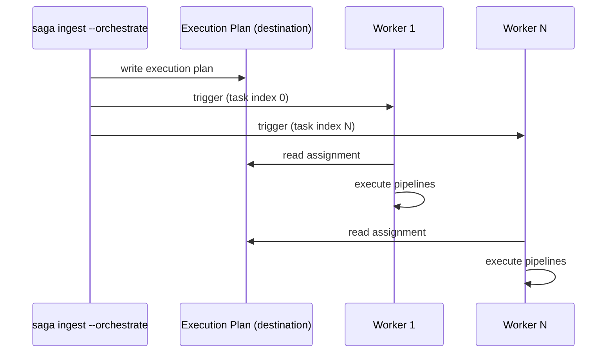

# Deployment Guide

## Execution Modes

dlt-saga supports two execution modes:

**Local (default)** — pipelines run in the current process, using `--workers` for parallelism.

```bash
saga ingest --workers 8 --select "tag:daily"
```

**Orchestrated** — the framework fans out to parallel workers via the configured `OrchestrationProvider`. Enable with `--orchestrate`:

> **Using Dagster, Airflow, or Prefect?** Skip this layer and let the external orchestrator own scheduling and execution — see [Orchestration Recipes](Orchestration-Recipes) for `Session`-based integration patterns.

```bash
saga ingest --orchestrate --select "tag:daily"
```

Configure orchestration in `saga_project.yml`:

```yaml
orchestration:
  provider: cloud_run        # or stdout
  region: europe-west1
  job_name: dlt-saga-worker
  schema: dlt_orchestration  # schema for execution plan tables
```

---

## How Orchestration Works



The orchestrator:
1. Discovers matching pipelines and partitions them into tasks
2. Writes an execution plan to the destination (`_saga_execution_plans` table)
3. Triggers N workers — each worker reads its assignment by task index and runs its assigned pipelines

---

## Orchestration Providers

### `cloud_run`

Triggers a [Cloud Run Job](https://cloud.google.com/run/docs/create-jobs) with multiple parallel task instances.

```yaml
orchestration:
  provider: cloud_run
  region: europe-west1
  job_name: dlt-saga-worker
```

Workers receive their task index automatically via `CLOUD_RUN_TASK_INDEX` (set by Cloud Run) and the execution plan ID via `SAGA_EXECUTION_ID` (set by the orchestrator).

**Minimum IAM for the worker service account:**

| Permission | Purpose |
|------------|---------|
| `bigquery.dataEditor` | Write pipeline data and read/write execution plan tables |
| `bigquery.jobUser` | Run BigQuery jobs |
| `secretmanager.secretAccessor` | Access secrets (if using Secret Manager provider) |
| `iam.serviceAccountTokenCreator` on target SA | Service account impersonation (prod only) |

### `stdout`

Outputs the execution plan as JSON to stdout. Use this with external orchestrators (Airflow, Cloud Workflows, Prefect, etc.) that manage task distribution themselves.

```yaml
orchestration:
  provider: stdout
```

---

## `saga plan` and `saga worker`

For external orchestrators, use `saga plan` to create the plan and `saga worker` to execute each task:

**Step 1 — create the execution plan:**

```bash
saga plan --command ingest --select "tag:daily" --target prod
# Outputs JSON with execution ID and task assignments
# Use --dry-run to preview without persisting
```

**Step 2 — run each worker:**

```bash
saga worker \
  --execution-id <id-from-plan> \
  --task-index 0 \
  --command ingest \
  --target prod
```

**Worker environment variables** — use these in containerised deployments instead of passing flags:

| Variable | Description |
|----------|-------------|
| `SAGA_EXECUTION_ID` | Execution plan ID (fallback for `--execution-id`) |
| `CLOUD_RUN_TASK_INDEX` | Task index — set automatically by Cloud Run, takes precedence |
| `SAGA_TASK_INDEX` | Task index — fallback when not on Cloud Run |
| `SAGA_WORKER_COMMAND` | Command: `ingest`, `historize`, or `run` (fallback for `--command`) |

---

## Containerisation

Workers need `dlt-saga` and any optional dependencies installed in the image:

```dockerfile
FROM python:3.12-slim
RUN pip install dlt-saga[bigquery]
COPY . /app
WORKDIR /app
CMD ["saga", "worker"]
```

For Databricks on Azure: `pip install dlt-saga[databricks,azure]`.

---

## CI/CD with GitHub Actions

### Azure Databricks

With `auth_mode: azure_default` in `profiles.yml`, a single service principal covers Databricks, Key Vault, and ADLS — no Databricks-specific credentials needed.

**GitHub Actions secrets to configure:**

| Secret | Value |
|---|---|
| `DATABRICKS_SERVER_HOSTNAME` | `adb-1234.12.azuredatabricks.net` |
| `DATABRICKS_HTTP_PATH` | `/sql/1.0/warehouses/abc123` |
| `DATABRICKS_CATALOG` | `prod_catalog` |
| `AZURE_CLIENT_ID` | Service principal app (client) ID |
| `AZURE_CLIENT_SECRET` | Service principal secret |
| `AZURE_TENANT_ID` | Azure AD tenant ID |

**Workflow:**

```yaml
name: Ingest

on:
  schedule:
    - cron: '0 6 * * *'
  workflow_dispatch:

jobs:
  ingest:
    runs-on: ubuntu-latest
    steps:
      - uses: actions/checkout@v4

      - uses: actions/setup-python@v5
        with:
          python-version: "3.12"

      - name: Install
        run: pip install 'dlt-saga[databricks,azure]'

      - name: Ingest
        env:
          DATABRICKS_SERVER_HOSTNAME: ${{ secrets.DATABRICKS_SERVER_HOSTNAME }}
          DATABRICKS_HTTP_PATH: ${{ secrets.DATABRICKS_HTTP_PATH }}
          DATABRICKS_CATALOG: ${{ secrets.DATABRICKS_CATALOG }}
          AZURE_CLIENT_ID: ${{ secrets.AZURE_CLIENT_ID }}
          AZURE_CLIENT_SECRET: ${{ secrets.AZURE_CLIENT_SECRET }}
          AZURE_TENANT_ID: ${{ secrets.AZURE_TENANT_ID }}
        run: saga ingest --target prod
```

The `profiles.yml` (committed to the repo) references the connection env vars via `{{ env_var('...') }}` and sets `auth_mode: azure_default`. No credentials are stored in the profile file. See [Profiles Guide](Profiles#databricks-authentication) for the full Databricks profile reference.

### GCP / BigQuery

```yaml
      - name: Ingest
        env:
          GOOGLE_APPLICATION_CREDENTIALS: ${{ secrets.GOOGLE_APPLICATION_CREDENTIALS }}
        run: saga ingest --target prod
```

Or use [Workload Identity Federation](https://cloud.google.com/iam/docs/workload-identity-federation) to avoid storing a key file.

---

## Profiles in Production

Use a `prod` target in `profiles.yml` with `run_as` for service account impersonation:

```yaml
default:
  outputs:
    prod:
      project: your-project
      location: EU
      destination_type: bigquery
      run_as: dlt-saga-sa@your-project.iam.gserviceaccount.com
```

Pass `--target prod` when triggering production runs, or set it as the profile default.

Impersonation is entirely in-process — no `gcloud` config files are modified. See the [Profiles Guide](Profiles) for details.

---

## Troubleshooting

| Issue | Check |
|-------|-------|
| Worker can't find execution plan | Verify `SAGA_EXECUTION_ID` is set and the orchestration schema is accessible |
| Wrong task index | Check `CLOUD_RUN_TASK_INDEX` or `SAGA_TASK_INDEX` env var |
| Auth errors in workers | Confirm the service account has `bigquery.dataEditor` and `bigquery.jobUser` |
| Impersonation failing | Verify ADC is configured and the caller has `iam.serviceAccountTokenCreator` on the target SA |
